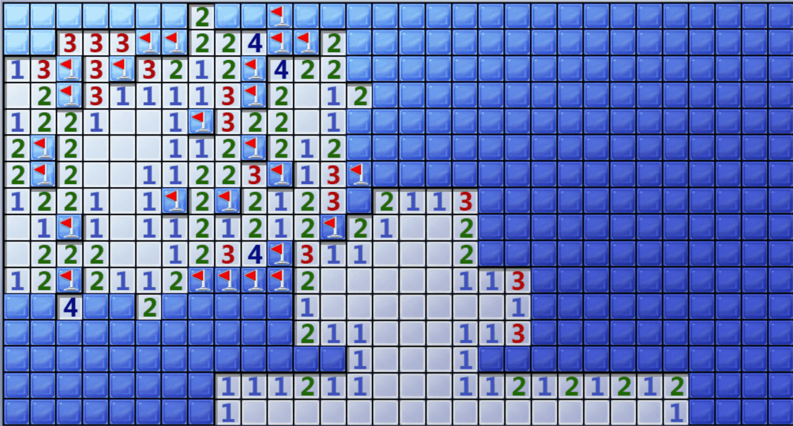
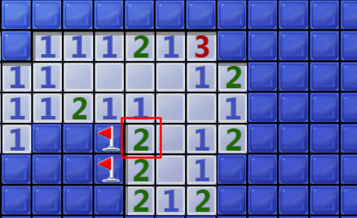
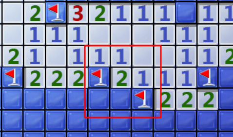
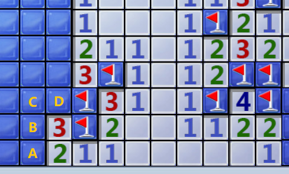
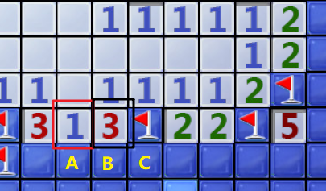
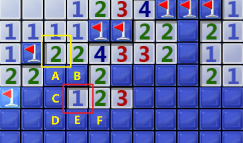

# minesweeper cheater




## 参数

```go
var (
    // 程序标题
    processTitle = "扫雷"
    // 当游戏失败时弹窗标题
    failedTitle = "游戏失败"
    // 当游戏成功时弹窗标题
    successTitle = "游戏胜利"
    // 鼠标点击时间间隔
    // 过快可能会导致异常: 比如先单击后双击,系统会判定为先双击后单击
    // 若<200ms,useDoubleClick 会自动调整为false
    // 不可<100ms,鼠标操作会错乱,此时会自动调整为100ms
    clickInterval = time.Millisecond * 120
    // 是否使用双击策略
    // 若 !showFlag || clickInterval<200ms 此设置自动调整为false;
    useDoubleClick = false
    // 是否插棋
    showFlag = false
    // 猜测策略：random/edge
    // random: 平等随机
    // edge: 加权随机,边缘的单元格权重更高(边缘单元格优先更容易踩雷,但有利于快速解决)
    // guessStrategy必须是随机的,否则当游戏失败且whenFailed=restart时,就永远困死在这一关了
    guessStrategy = "random"
    // 当失败时: restart/again/stop/exit
    whenFailed = "again"
    // 当成功时: again/stop/exit
    whenSuccess = "again"
)
```


## 主要流程

1. 找到扫雷的 hWnd，将 hWnd 缩放并移动到固定位置，窗口置顶。
2. 截图，识别每个单元格并将其转为一个二维数组。
3. 执行扫雷策略，推理明确某些单元格。
4. syscall 操纵鼠标点击单元格。


## 扫雷的 7 个策略

**策略一：若未开发的单元格等于剩下的雷数，则剩下的单元格都是雷。**

如下，红框中的单元格，其数值是 2，周围剩下 2 个单元格为开发，说明这 2 个单元格都是雷。



同理图二，单元格数值为 3，已经标记了一个雷，此时周围还有 2 个单元格未开发，说明这 2 个都是雷。


**策略二：若已发现的雷数等于单元格数字，则剩下的都不是雷。**

如下，单元格数值为 2，周围已经标记了 2 个雷，说明剩下的未开发单元格都不是雷。




**策略三：对单元格 P 来说，若其邻居 N 对于 P 的所有可能情况，都能使得 N 满足策略二，那么 N 就可以明确部分单元格必定不是雷。**

如下，对于底下的单元格 2，他所有的可能情况是：

- A 是雷，且 B 不是雷
- A 不是雷，且 B 是雷

无论是哪种情况，对于他上面的单元格 3 来说，都已经满足了策略二（雷的数量等于数值），因此 C 和 D 必定不是雷。




**策略四：将单元格 P 其所有可能情况，交给其邻居 N 验证并排除部分情况后，发现某些单元格在剩下的可行情况中是一致的，那么 N 就可以明确这些单元格必定是雷。**

如下，黑框中的单元格 3，其所有可能情况是：

- A、B 是雷，且 C 不是雷
- A、C 是雷，且 B 不是雷
- B、C 是雷，且 A 不是雷

对于红框中的单元格 1 来说，情况 3 是不成立的，因为此时其周围的雷数大于其数值。在排除情况 3 后，发现情况 1 和 情况 2 有一个共同特点：A 是雷。所以我们就可以明确 A 是雷。



> 显然，策略一是策略四的特殊情况，策略二是策略三的特殊情况。


**策略五：对于两个互为二级邻居的单元格 P、N，P 的所有情况都使得 N 满足策略三，此时可以明确部分单元格必定不是雷**。

如下，红框单元格和黄框单元格是二级邻居。对于黄框中的单元格 2 来说，所有的可能情况是：

- A 是雷，且 B 不是雷
- B 是雷，且 A 不是雷

无论是哪种情况，对于红框中的单元格 1 来说，都满足策略三，所以 C、D、E、F 必定不是雷。



> 显然，策略三又是策略五的特殊情况。同理，策略四会有一个对应的策略六，这里就不再赘述。

策略五和策略六是最复杂的，却是十分重要的，经常是破局的关键。


**策略七：当上述六个策略都无法得出新的进展时，随机选择一个单元格**。

上述 6 个策略都是有严格的逻辑推断的。扫雷失败的唯一原因正是策略七。